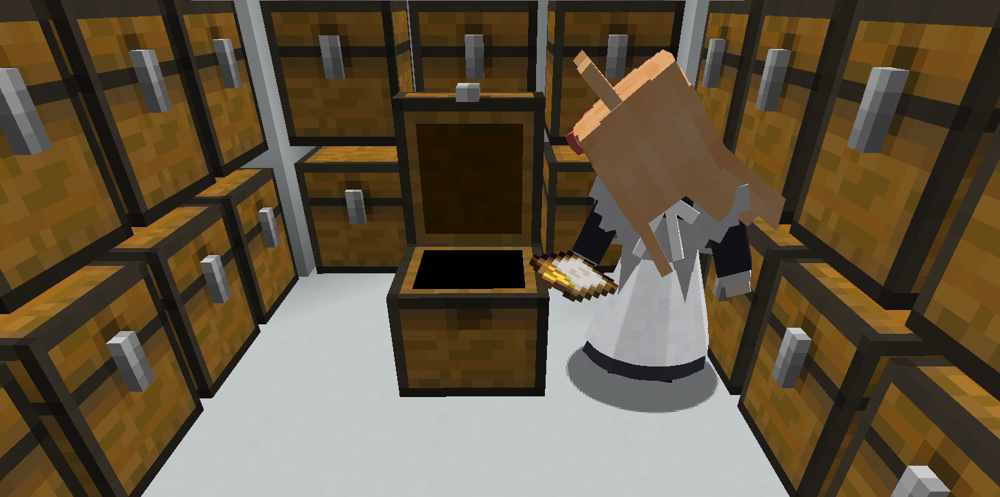

# 女仆仓管

为车万女仆添加了新的职业，现在女仆可以捡起地上的物品并将其放入附近的箱子，或者根据你的计划清单为你找到对应的物品。

## 开发阶段说明

该模组正在早期测试阶段。如果遇到女仆在工作中出现卡死等情况，请在配置文件中打开debug选项并截图游戏中女仆卡死的位置，并描述触发条件进行反馈。

## 用法

### 过滤器

在箱子上放置物品展示框，并将过滤器/禁止访问标志放入其中即可。

如果女仆看到了箱子中不符合过滤器的物品，会尝试将其取出并放入其他箱子。

### 存入

将物品直接扔给女仆，女仆会在闲暇时刻找到附近的箱子并将背包中的所有物品存入其中。

女仆存入物品遵顼下面的顺序
+ 如果查看过的箱子中存在白名单过滤器，则女仆会优先将物品存入该箱子。
+ 如果查看过的箱子中有存放过当前物品，则女仆会将物品存入该箱子
+ 如果没有找到合适的箱子，女仆会尝试将物品存入附近任意没有标记为禁止访问的箱子中

### 查找

你可以让女仆为你找到某些物品。

1. 合成一个`请求列表`物品
2. 右键打开GUI
3. 在其中填入需要的物品以及数量（滚轮控制数量）
4. （可选，如果需要存入某个箱子）潜行右键目标箱子来绑定存储。
5. 将这个列表交给女仆

女仆会按照列表去附近寻找物品，当工作完成（无论有没有找到），女仆会把结果物品放入目标箱子，并尝试把列表也放进去。查找物品的目标箱子不会受禁止访问的影响。

### 列表

在工作空闲时，女仆会四处寻找箱子并打开查看其中的内容物。你可以将一个`存储清单`交给女仆，她将会将自己记忆中的物品存量记录并返还一个`记录的存储清单`。

## 兼容性说明

- 女仆会尝试从AE终端中提取物品（但是目前不会尝试合成），可在配置文件关闭。
- 女仆会尝试在开箱时显示开箱动画。理论上来说，如果目标容器在多人游戏时能够显示开启关闭状态，那么女仆开关箱子也能被正常同步。
- 女仆会通过在容器内放入一个物品的方式来尝试进行多方块容器识别，请关注是否有不兼容的模组。

## 资产使用协议

模组使用了车万女仆中的部分界面元素并做了一定修改，因此assets/texture/gui下的资产将沿用 cc-by-nc-sa-4.0 协议进行共享。

其他资产和代码授权见license文件。