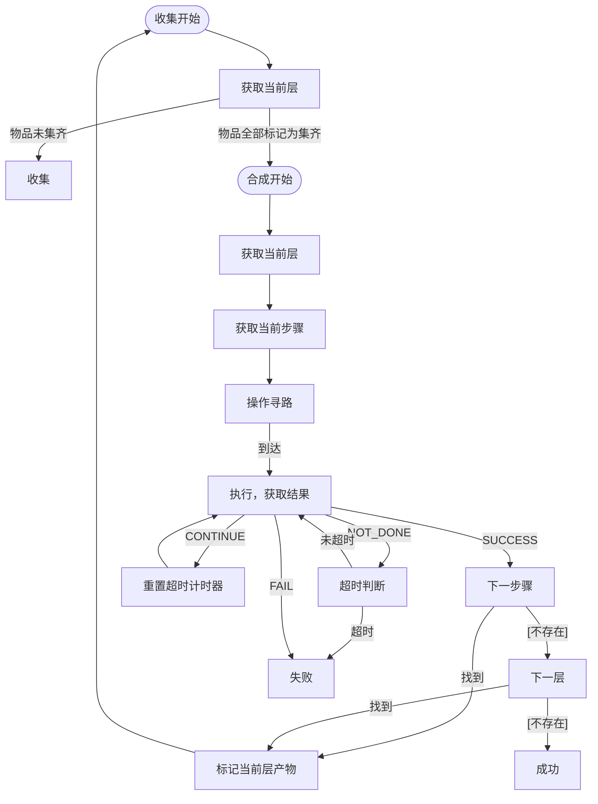

# 合成系统

## 目标

+ 根据已经记录的所有合成指南，计算出合理的合成方案，并生成合成步骤交由女仆执行

## 概念

**合成指南**：包含了若干个`合成操作`。可以是合成计算图的节点之一，可以直接由物品合成指南表示。

**合成操作**：包含了操作位置、操作类型以及涉及的输入输出物品和其他信息。

**合成步骤（合成层）**：包含了当前步骤需要的物品和当前步骤进行的合成指南的对象。是合成行为的基本对象。

**合成方案**：合成步骤按照操作树后序遍历排列的列表。按照顺序依次执行即可得到最终产物。

## 一般操作流程

合成以合成层为单位进行。女仆会获取目前正在处理的合成层，并在合成层中获取当前正在执行的操作，然后获取0一个操作上下文并执行合成操作。

