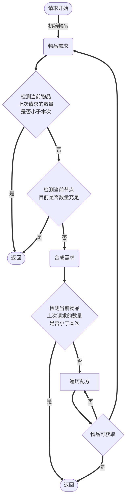

# 合成系统

## 目标

+ 根据已经记录的所有合成指南，计算出合理的合成方案，并生成合成步骤交由女仆执行

## 概念

**合成指南**：包含了若干个`合成操作`。可以是合成计算图的节点之一，可以直接由物品合成指南表示。

**合成操作**：包含了操作位置、操作类型以及涉及的输入输出物品和其他信息。

**合成步骤（合成层）**：包含了当前步骤需要的物品和当前步骤进行的合成指南的对象。是合成行为的基本对象。

**合成方案**：合成步骤按照操作树后序遍历排列的列表。按照顺序依次执行即可得到最终产物。

## 一般操作流程

合成以合成层为单位进行。女仆会获取目前正在处理的合成层，并在合成层中获取当前正在执行的操作，然后获取0一个操作上下文并执行合成操作。


## 合成计算流程



```javascript
function getStartAtIndex(item, count) {
    let maxSuccess;
    let maxScore;
    let maxI;
    for (let _i = 0; _i < item.crafts.length; _i++) {
        let i = (_i + startAt) % item.crafts.length;
        let craft = item.crafts[i];
        //边权重即表示配方一次输出的物品数量。
        let require = Math.ceil(stillRequire / item.crafts[i].weight);
        success = calcCraft(craft, require) * craft.weight;
        
        let currentScore = getScore();//从上下文获取合成方案评分。有些冗长，大致是在合成递归过程中收集各类信息然后根据一个固定公式计算。
        
        if(success > maxSuccess || (success == maxSuccess &&  score > maxScore)){
            maxSuccess = success;
            maxScore = currentScore;
            maxI = i;
        }
    }
    return maxI;
}

function calcItem(item, count) {
    if (item.count >= count) {
        //物品已满足需求，直接返回
        return item.count;
    }
    if (item.lastRequestCount < count) {
        //物品这次需要的数量比上次需要的数量更大，说明物品处在一个递减的环中，此时继续迭代不可能计算得到结果，直接返回当前可用的数量
        return item.count;
    }
    let stillRequire = count - item.count;
    标记物品已使用();
    //获取最优配方。通过这种方式来实现计算出消耗物品较少或者合成路径较短的方案
    let startAt = getStartAtIndex(item, count);
    for (let _i = 0; _i < item.crafts.length; _i++) {
        let i = (_i + startAt) % item.crafts.length;
        let craft = item.crafts[i];
        //边权重即表示配方一次输出的物品数量。
        let require = Math.ceil(stillRequire / item.crafts[i].weight);
        success = calcCraft(craft, require) * craft.weight;
        stillRequire -= success;
        //所有都成功了
        if (stillRequire <= 0) {
            return require;
        }
    }
    return require - stillRequire;
}

function calcCraft(craft, count) {
    let currentRequire = count;
    while (currentRequire > 0) {
        for (let i = 0; i < craft.inputs.length; i++) {
            let input = craft.inputs[i];
            //这是require次合成需要的输入物品总量
            let require = count * input.weight;
            let currentSuccess = calcItem(input, require);
            //如果合成失败，那么记录最小成功的数量，然后重试
            if (currentSuccess < require) {
                currentRequire = currentSuccess;
                break;
            }
            //返回最终成功的数量
            if (i === craft.inputs.length - 1) {
                return currentRequire;
            }
        }
    }
    return currentRequire;
}
```
