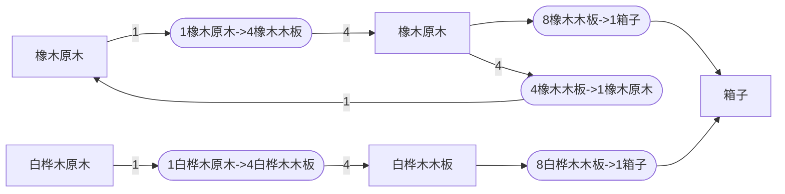

# 合成和配方生成相关设计简介

## 目标

根据Minecraft配方管理器中得到的配方列表，以及在女仆工作区域内识别到的所有能够执行某类型配方的方块，选择合适的配方并生成合成图中的合成指南。

其中几个主要问题：

1. 合成图中的合成指南输入输出均为物品，从原料转为物品可能需要对原料进行组合。这个步骤的复杂度难以预估（可能会比较大，也可能其实并不大）。
2. 生成过程中的生成图非常大，至少会包含上万个节点，且未来根据支持的配方种类的增加还会继续上涨。
3. 构建图的过程中需要比较Ingredient是否相等（如上图的木棍和箱子共享了同一个配方节点）

## 概念

### 合成图
+ **合成指南**: 合成指南是女仆进行合成的基础对象，直接描述了若干个合成步骤，女仆可以直接根据这一对象执行一个具体的合成。合成指南有若干物品输入和输出。
+ **合成节点**: 直接对应一个合成指南，出边和入边都对应一个物品节点。
+ **物品节点**: 一个或多个被时为同一物品的物品堆(ItemStack)，使用物品堆&数量进行描述。
+ **边**: 边权表示合成需要或者产出的物品数量。连接到合成节点的边表示需要的数量，从合成节点出发的表示产出的数量。

### 配方生成图
+ **原料节点**: 对应原料，即Ingredient。
+ **物品节点**: 对应物品，即ItemStack。与合成图相同
+ **生成中的合成配方节点（下称配方节点）**: 直接对应到原版配方。输入是若干`原料`，输出是若干`物品`
+ **边**: 生成中的配方边没有权值，因为不需要计算是否合法，只需要判断是否有合成可能性。

## 当前方案

### 生成配方

构建有向图，其中有三类节点，分别为原料、配方、物品。边的方向为原料->配方->物品->原料...。

#### 第一步，建图。

1. 对于找到的每个可能的工作方块，生成若干各配方节点，如对于工作台，可能会加入上图的C1C2节点。
2. 对于每个配方节点，计算其原料列表，对于每个原料，将其加入图中，并保证相同的原料不被重复添加，如对于C1、C2，其只会添加一次B1节点
3. 对于每个配方节点，计算产物节点，如A8、A9
4. 对于每个原料节点，计算其可能的来源物品，如A1-A7

对每个配方进行上述操作，即可得到一个包含了所有配方的图。

原料节点在比较时采用对比可用物品的方法进行，即如果两个原料可以接受的物品列表完全相同，则视为同一个原料。

> 这里实际实现时有一些优化，即在游戏启动时预处理所有确定的配方的原料，并将其使用UUID进行维护。
> 在生成配方时，如果当前配方以及缓存过，那么可以省去与图中其他的原料节点的比较过程。

#### 第二步，相关性判断

从请求的物品开始反向遍历整个图。将遍历到的节点标记为可能相关节点。

#### 第三步，可达性计算

从仓库中的原材料开始，广度优先遍历整个图。被访问过的节点会被标记为`可用的`

+ 如果遍历到配方节点，要求连接到其的原料节点均为可用的节点
+ 如果遍历到原料节点，要求连接到其的物品节点至少有一个可用节点
+ 如果遍历到物品节点，直接标记为可用

如果遍历到配方节点是可用的，那么则为这个配方生成一个`合成指南`。生成时按顺序组合原料的所有可接受的物品，如对于上图的床，则会为每一种羊毛和每一种木板的组合都生成一次合成指南。

> 这里还有一个做法是如果配方节点有任意原料节点可用就标记为添加。这样做的好处是当材料不足时更有利于计算缺少的物品，但是最终被遍历的节点会增长若干倍。

### 合成树计算

简单遍历。更具体的稍后再写。